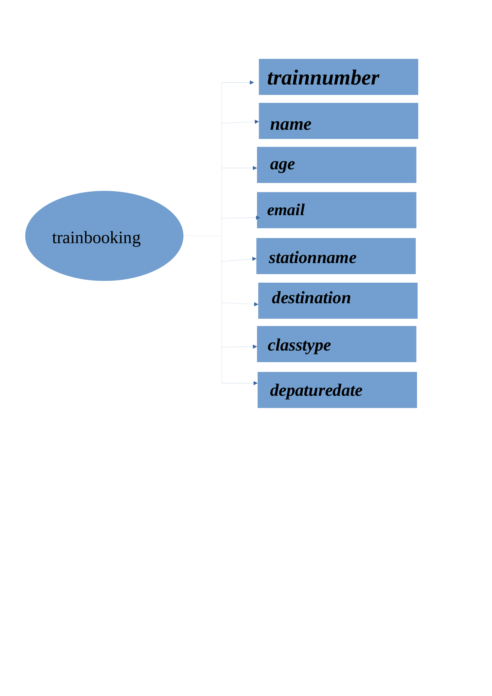
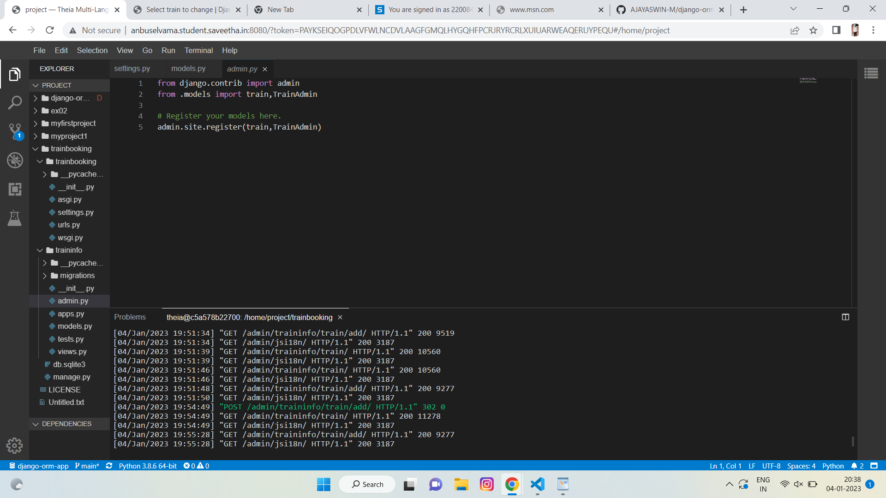
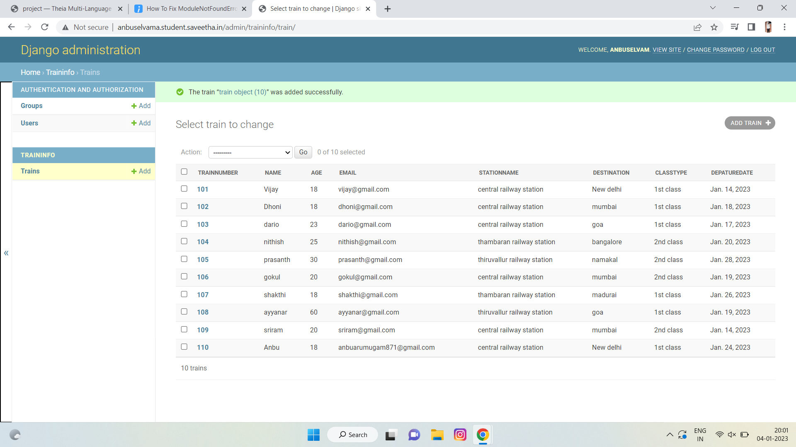

# Django ORM Web Application

## AIM
To develop a Django application to store and retrieve data from a database using Object Relational Mapping(ORM).

## Entity Relationship Diagram



## DESIGN STEPS

### STEP 1:
create and customers infomartion using django application


### STEP 2:
Implement that as Python code


### STEP 3:

push that python code to github


## PROGRAM
```
from django.db import models
from django.contrib import admin
# Create your models here.
class train(models.Model):
    trainnumber = models.IntegerField(max_length=10, help_text="Your Train Number")
    name =models.CharField(max_length=100)
    age = models.IntegerField()
    email = models.EmailField()
    destination = models.CharField(max_length=100)
    stationname = models.CharField(max_length=100)
    destination = models.CharField(max_length=100)
    classtype = models.CharField(max_length=128)
    depaturedate = models.DateField()
class TrainAdmin(admin.ModelAdmin):
    list_display = ('trainnumber','name','age','email','stationname','destination','classtype','depaturedate')

```


## OUTPUT





## RESULT
The program was executed Successfully.